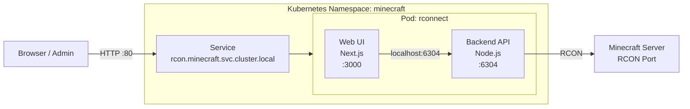

# RCONnect – Kubernetes Deployment (GHCR)

This fork adds first-class Kubernetes support for running **RCONnect** as a lightweight, in-cluster service using **GitHub Container Registry (GHCR)**.

The application is deployed as a **single Pod with two containers**:

* **web**: Next.js UI
* **api**: Node.js backend (RCON API, port `6304`)

Both containers run in the same Pod and communicate via `localhost`.

---

## Architecture Overview



---

## Key Design Decisions

* **Single Deployment, two containers**

  * No process supervisors
  * Independent health probes per component
* **ClusterIP Service**

  * In-cluster access via:

    ```
    rcon.minecraft.svc.cluster.local
    ```
* **Stateless backend**

  * No persistent volume required
* **GHCR-based images**

  * Simple build and distribution
  * CI/CD ready

---

## Container Images

Images are built and pushed to **GitHub Container Registry**:

```
ghcr.io/gotthub/rconnect-web:latest
ghcr.io/gotthub/rconnect-api:latest
```

---

## Build Images Locally

From the repository root:

```bash
docker build -f Dockerfile.web -t ghcr.io/gotthub/rconnect-web:latest .
docker build -f Dockerfile.api -t ghcr.io/gotthub/rconnect-api:latest .
```

Authenticate once (required for push):

```bash
echo $GITHUB_TOKEN | docker login ghcr.io -u gotthub --password-stdin
```

Push images:

```bash
docker push ghcr.io/gotthub/rconnect-web:latest
docker push ghcr.io/gotthub/rconnect-api:latest
```

---

## Kubernetes Deployment

### Prerequisites

* Running Kubernetes cluster
* Namespace `minecraft` exists
* Images are public **or** an imagePullSecret is configured

### Apply manifest

```bash
kubectl apply -f k8s/rcn.yaml
```

Verify rollout:

```bash
kubectl -n minecraft rollout status deployment/rconnect
kubectl -n minecraft get pods,svc
```

---

## Service Endpoints

### Web UI

```
http://rcon.minecraft.svc.cluster.local
```

### Backend API (optional direct access)

```
http://rcon.minecraft.svc.cluster.local:6304
```

Inside the Pod, the web UI communicates with the backend via:

```
http://127.0.0.1:6304
```

Configured through the environment variable:

```yaml
env:
  - name: RCONNECT_BACKEND_URL
    value: "http://127.0.0.1:6304"
```

---

## Configuration Notes

### Backend Port

The backend API listens on port **6304** and is configured via:

```yaml
- name: PORT
  value: "6304"
```

### RCON Target

RCON host, port, and password are currently configured through the UI.
They can be externalized later using Kubernetes `Secret` resources if required.

---

## Health Checks

Both containers expose TCP-based health probes:

* Web UI: port `3000`
* Backend API: port `6304`

This allows Kubernetes to restart either container independently if needed.

---

## Security Considerations

* The Service is **ClusterIP only** and not exposed externally
* For external access, consider:

  * Ingress with authentication
  * Temporary `kubectl port-forward` for admin use

---
